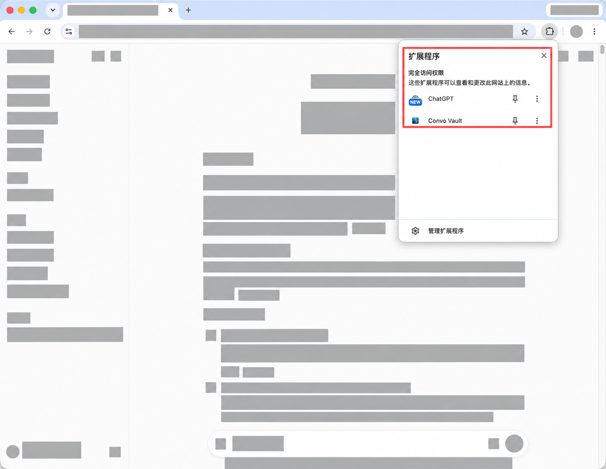
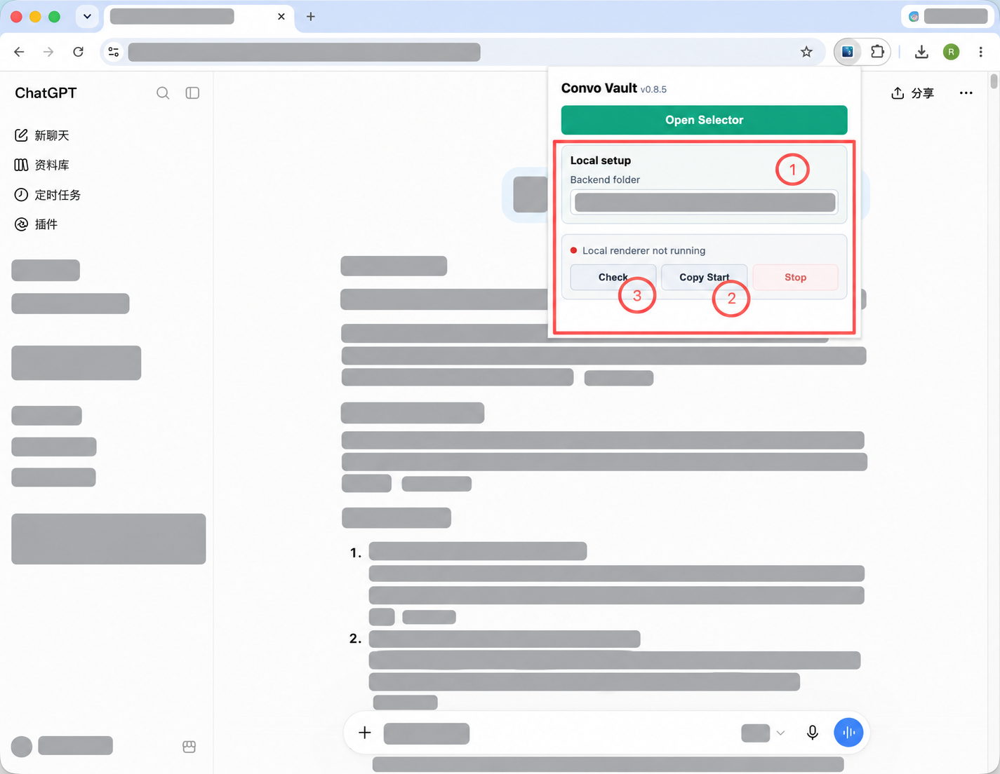
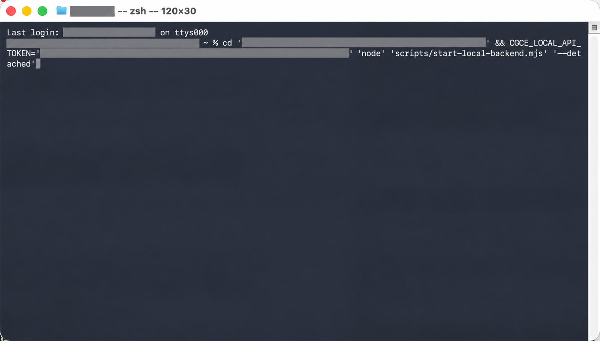
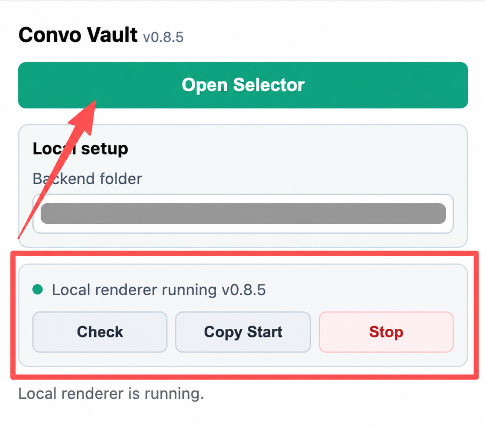
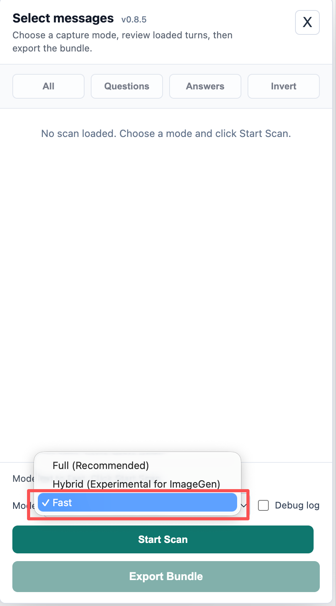
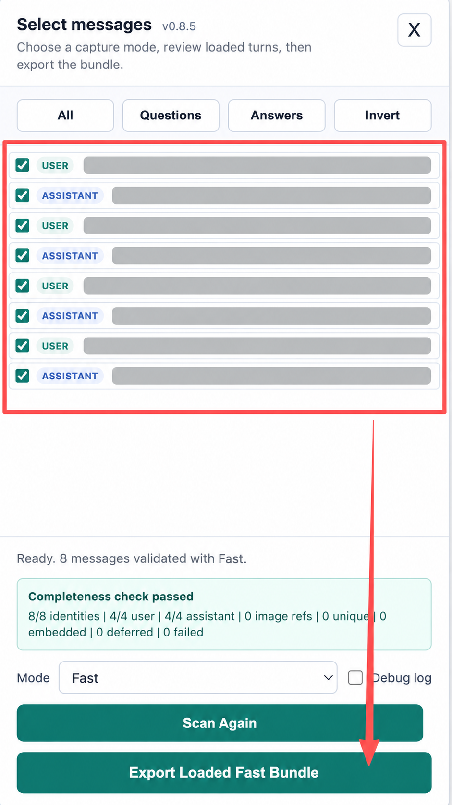
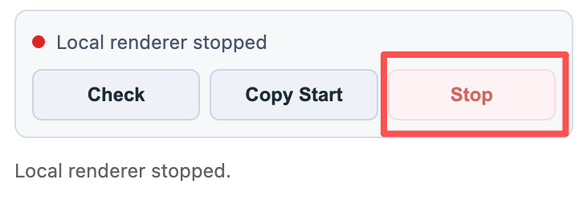

# Convo Vault

如果要在 ChatGPT 里长期沉淀有价值的对话资产，怎么办？

如果一段长对话里混着代码、表格、图片、文件线索和复杂思考过程，手动复制太痛苦，怎么办？

如果你不想把私密对话丢给陌生在线转换工具，但又想要漂亮的 Markdown、PDF 和结构化数据，怎么办？

现在你有了 **Convo Vault**。

Convo Vault 是一个本地优先的 Chrome 扩展，用来把 ChatGPT 对话导出成可以长期保存、检索和供各类 Agent 二次处理的通用知识包（Universal Knowledge Pack）。它会读取你当前打开的 ChatGPT 对话，把选中的消息打包成本地 `.zip`，里面包含高保真排版的 Markdown、PDF，以及适合后续放进各类 AI Agent（如 Codex、Claude、Cursor、本地智能体）、知识库、搜索索引或 RAG 流程的结构化数据（JSONL、QA 对、主题图谱、实体索引与深度推理追踪）。

当前版本：`0.8.5`

## 最近更新

`0.8.5` 深度强化思考链（Thinking Trace）与文献引用可点击性：

- **高保真深度思考捕获**：支持长达数分钟的复杂多步思考链（Multi-Step Chain-of-Thought）全量提取，耗时与推理标题规范化折叠
- **点击直达的文献引用**：搜索引用与云端文档切片全面转换为标准 Markdown 格式，引用角标点击直达目标源
- **架构解耦与纯净知识包**：彻底解除对下游特定笔记软件（如 Obsidian）的强制绑定，回归通用 Agent 知识资产原语

`0.8.3` 强化图像素材完整性与离线账本：

- **图像素材完整归档**：多模态对话中的关键图片本地 SHA-256 缓存归档，远端引用与占位卡片标准化
- **Assets Manifest 账本**：详细记录全部 100+ 媒体资产的来源、存储策略、降级原因与引用位置

`0.8.2` 迁移 ChatGPT 复数分页接口（Plural API Pagination）：

- **Fast API 分页自动穿越**：全面适配 `/backend-api/conversations/{id}` 最新长对话分页流，自动向前分页至对话起点
- **会话 Token 凭证自愈**：当 `/api/auth/session` 受限时，自动无缝提取网页端 Bootstrap Session，无需用户重新登录

`0.8.1` 推出 Agent 认知与工具调用执行链路 Sidecars（`*.agent-trace.json` & `*.agent-trace.md`）：

- **执行追踪隔离归档**：将 ChatGPT 内部的文档切片（`[L1]...`）、Python 沙盒代码与 Web 搜索操作单独提取为 Agent 报告，避免污染干净的 Markdown/PDF 答复正文
- **思考活动时间线**：计划 (`💬`)、工具 (`🔌`)、搜索 (`🔍`)、执行 (`⚙️`)、推理 (`🧠`) 结构化分类呈现

`0.7.26` 重磅推出 Fast 2.0 轮次聚合引擎（Turn-Chain Synthesizer）与全维度元数据提取：

- **Turn-Chain 轮次链路聚合**：彻底解决多步工具调用（DALL-E 绘图、代码沙盒、Drive 插件）导致的 11 条助手回复漏抓与图片丢失问题；保证每个用户提问严格对称对应一个高保真助手大卡片（100% 轮次召回）
- **DALL-E 与多模态图像资产全量保留**：自动提取 DALL-E 绘图节点生成的全部高清图片指针与沙盒工件，消灭 Same-Role Adjacency 断层
- **思考链与精准耗时（Thinking Process & Duration）**：自动提取思考摘要、推理标题与真实思考秒数（如 `Worked for 11s`、`Worked for 9m 38s`），格式化为折叠思考块
- **文献引用与标准角标（Sources & Citations Footnotes）**：自动解析 Google Docs / 网页调研引用，将内部标记替换为标准 Markdown 文献脚注 `[^1]: [标题](URL)`
- **长期记忆与历史对话（Memory & Context）**：自动提取记忆引用与前置历史对话关联卡片

## 怎么使用 (快速上手指南)

### 步骤 1：安装与环境准备

```bash
# 1. 克隆项目到本地
git clone https://github.com/rcha585/convo-vault.git
cd convo-vault

# 2. 安装本地渲染后端依赖
cd tools/advanced-pdf
pnpm install
cd ../..

# 3. 一键构建 Chrome 扩展
npm run build:extension
```

构建完成后，在 Chrome 浏览器中加载扩展：
1. 访问 `chrome://extensions/` 并开启右上角 **开发者模式 (Developer mode)**。
2. 点击 **加载已解压的扩展程序 (Load unpacked)**，选择仓库目录下的 `dist/convo-vault-extension` 文件夹。

---

### 步骤 2：图文实操操作流程 (7 步完整走通)

#### 1. 打开对话并唤起扩展面板
在 Chrome 打开任意已登录的 ChatGPT 对话页面，点击浏览器右上角工具栏的 **Convo Vault** 扩展图标，弹出扩展管理浮窗。

<p align="center">
  
</p>

#### 2. 配置本地服务路径并复制启动命令
在浮窗中，扩展已智能生成访问令牌（Token）。确认下方 `Backend folder` 填入当前仓库所在的绝对路径，点击 **Copy Start**。

<p align="center">
  
</p>

#### 3. 打开终端粘贴启动本地渲染服务
打开系统终端（Terminal / PowerShell），直接粘贴刚才复制的命令并回车，本地高保真渲染后端即刻启动监听 `127.0.0.1`。

<p align="center">
  
</p>

#### 4. 打开会话选择器 (Open Selector)
返回 ChatGPT 网页，再次点击扩展图标，点击 **Open Selector** 按钮唤起网页内嵌的高级导出控制面板。

<p align="center">
  
</p>

#### 5. 选择抓取模式 (Fast / Full / Hybrid)
根据需求选择最合适的捕获引擎（长对话与包含特殊图片推荐 `Full`，追求极速与纯净 API 拓扑推荐 `Fast`），点击 **Start Scan** 开始扫描。

<p align="center">
  
</p>

#### 6. 展开核验完整性并导出知识包
扫描完成后，面板会呈现**完整性闸门审计报告（Integrity Gate）**。你可以自由展开对话轮次、检视各节点状态与素材，核对无误后点击右下角 **Export Selected (ZIP)**，即可一键下载全套结构化知识包！

<p align="center">
  
</p>

#### 7. 导出完成，随手停止本地后台服务
导出完毕后，随时可以在扩展浮窗中点击 **Stop** 优雅停止本地后端进程，释放端口与系统资源。

<p align="center">
  
</p>

## 需要什么环境

- Chrome 或 Chromium 系浏览器
- Node.js `20+`
- pnpm，用来安装本地 PDF 渲染后端依赖
- 一个已经登录 ChatGPT 的浏览器会话
- 本地可以运行 Node 服务的终端环境

常用命令：

```bash
npm run build:extension
npm run check
npm test
npm run test:fixtures
npm run backend:check
```

如果后端是通过 **Copy Start** 带 token 启动的，`backend:check` 也需要同一个 `CGCE_LOCAL_API_TOKEN`；没有 token 时返回 `401` 是安全拦截，不是服务坏了。

## 多语言导出

Convo Vault 的界面和按钮目前保持英文，但导出的对话内容按 Unicode 原文保留。也就是说，你可以导出中文、英文、西语、意大利语、日语、韩语，或者多种语言混合的 ChatGPT 对话。

`0.7.14` 加固了 PDF 渲染的多语言文字能力：

- PDF HTML 使用中性语言标记，避免把所有内容都当成中文页面
- 字体 fallback 增加日文、韩文、阿拉伯文、希伯来文和通用 Noto 字体链
- CI 里加入 `npm run test:fixtures` 样本回归流，覆盖西语重音、意大利语重音、日语、韩语、中文、阿拉伯语、希伯来语、emoji、代码块、表格和混合文字方向
- 样本库会同时检查 PDF HTML、Markdown 和 JSON data sidecar，避免只在某一种输出里“看起来正常”

这里的“多语言支持”指的是保留原语言导出，不是自动翻译。PDF、Markdown 和 JSON sidecars 都应该保留原始文本。

## 输出类型归档

`0.7.21` 开始把 ChatGPT 的轻量工作台输出分成两层处理：

- PDF 是给人看的阅读档案：公式、基础图表、代码、表格和图片尽量静态渲染；视频、音频、交互卡片和大文件以清晰卡片或源码降级展示。
- JSON / asset sidecars 是给机器和后续恢复用的证据档案：每个非纯文本对象都会尽量记录 `kind`、`renderStatus`、`degraded`、`degradationReason`、来源消息和链接/素材线索。

这意味着导出目标不是“把所有交互原样塞进 PDF”，而是保证内容不静默丢失：能读的进 PDF，不能静态表达的进 JSON，并在 PDF 中留下可理解的降级记录。

当前 PDF 静态渲染优先支持：

- 行内 / 块级公式，包括常见上下标、分数、根号和数学符号
- Mermaid flowchart、sequenceDiagram、erDiagram、stateDiagram
- 简单 `chart` 代码块，支持 JSON 或 CSV-like 数据生成柱状图、折线图
- GIF、远程图片、视频、音频和交互内容的清晰降级卡片

## Hybrid、Fast 和 Full

`Full` 是默认推荐模式。它扫描页面 DOM、处理虚拟化消息，并保留 ImageGen、图片型回复和没有普通 API `message-id` 的 assistant turn。

打开 Selector 不会启动任何模式。选择模式后必须点击 `Start Scan`。扫描运行期间模式会锁定；取消、关闭面板或任务失效后，旧结果不能覆盖当前快照。

`Hybrid` 仍然可用，但对 ImageGen 和其他非标准 assistant turn 标记为 Experimental。它先用 `Fast` 读取 ChatGPT conversation API，再用 `Full` 补充页面细节。若 Full 发现无法对齐 Fast 骨架的实质消息，完整性闸门会把结果标为不完整并阻止静默导出。

这意味着：

- Fast 里有、Full 里也能对齐的消息，会合并补强。
- Fast 里有、Full 没扫到的消息，会保留 Fast。
- Full 多抓出来但不能对齐 Fast 的实质候选，会进入完整性报告和 debug report，并阻止普通导出。
- 纯日期/时间分隔符，比如 `星期日 16:10`，会被当作非消息过滤掉。

`Fast` 是 API-first 模式，速度更快，结构更干净，适合快速确认对话骨架。

`Full` 是 DOM-only 深度扫描模式，速度更慢，但当前是长对话、ImageGen、Thinking/flyout 和特殊内容的正常推荐路径。

`Fast` 适合快速查看 API 骨架；`Hybrid` 适合实验性对比；需要完整归档时先选 `Full`。

## 安全措施

Convo Vault 的默认导出流程是本地优先：

- 扩展只读取当前打开的 ChatGPT 页面
- 渲染后端只监听 `127.0.0.1`
- PDF、Markdown 和 zip bundle 都在本机生成
- 不使用远程 PDF 服务
- 运行时数据默认放在 `.convo-vault/`，这个目录不会进 Git

本地后端现在带有 token 门禁：

- popup 会生成随机本地 token
- **Copy Start** 会把 token 传给本地后端
- popup 和 content script 请求后端时会带 `X-Convo-Vault-Token`
- 后端会校验 token，不匹配就返回 `401`
- 如果后端没有配置 token，带浏览器 `Origin` 的请求会被拒绝

这主要解决的是：普通网页不能随便调用你的本地后端，比如误触 `/shutdown`、提交大 payload 让本机渲染，或读取 `/health` 返回的信息。

还有一些产品化安全项会继续收紧，比如逐步减少 `<all_urls>` 权限、把更多图片抓取能力迁到本地后端、进一步细化 CORS 策略。当前优先保证核心导出链路稳定，不先破坏图片和附件导出能力。

## 会输出什么

每次导出通常会得到一个 `.zip` bundle，里面包含：

- `*.md`：可读 Markdown 档案
- `*.pdf`：本地渲染 PDF
- `*.payload.json`：完整导出 payload
- `*.conversation.json`：对话级元数据
- `*.messages.jsonl`：逐条消息 JSONL
- `*.qa-pairs.json`：问答配对
- `*.topics.json`：话题索引
- `*.entities.json`：链接、文件名、日期等实体线索
- `*.agent-trace.json`：Agent 认知与工具调用执行链路（含内部文档切片、搜索记录、代码调用）
- `*.agent-trace.md`：Agent 认知链路与工具执行可读分析报告
- `*.summary.md`：摘要索引
- `*.assets.manifest.json`：图片和附件资源清单

这些文件的目标不是只让你“下载一份聊天记录”，而是让一段重要对话变成真正属于你的本地资料：能读、能搜、能归档，也能继续接入你自己的知识库工作流。
